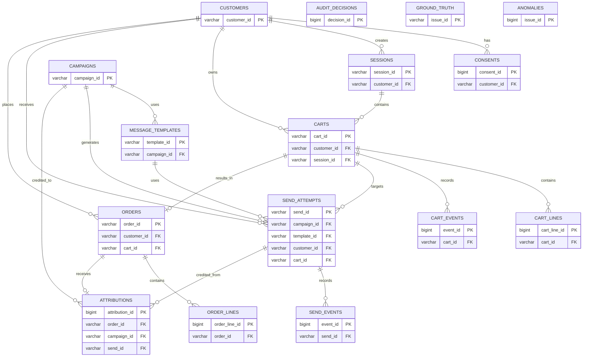

# Abandoned Cart Recovery – Entity Relationship Diagram

```mermaid
erDiagram

    CUSTOMERS ||--o{ CONSENTS : has
    CUSTOMERS ||--o{ SESSIONS : creates
    CUSTOMERS ||--o{ CARTS : owns
    SESSIONS ||--o{ CARTS : contains

    CARTS ||--o{ CART_LINES : contains
    CARTS ||--o{ CART_EVENTS : records
    CARTS ||--o{ SEND_ATTEMPTS : targets
    CARTS ||--o| ORDERS : results_in

    CAMPAIGNS ||--o{ MESSAGE_TEMPLATES : uses
    CAMPAIGNS ||--o{ SEND_ATTEMPTS : generates
    MESSAGE_TEMPLATES ||--o{ SEND_ATTEMPTS : uses

    CUSTOMERS ||--o{ SEND_ATTEMPTS : receives
    SEND_ATTEMPTS ||--o{ SEND_EVENTS : records

    CUSTOMERS ||--o{ ORDERS : places
    ORDERS ||--o{ ORDER_LINES : contains

    ORDERS ||--o| ATTRIBUTIONS : receives
    CAMPAIGNS ||--o{ ATTRIBUTIONS : credited_to
    SEND_ATTEMPTS ||--o{ ATTRIBUTIONS : credited_from

    CUSTOMERS {
        varchar customer_id PK
    }

    CONSENTS {
        bigint consent_id PK
        varchar customer_id FK
    }

    SESSIONS {
        varchar session_id PK
        varchar customer_id FK
    }

    CARTS {
        varchar cart_id PK
        varchar customer_id FK
        varchar session_id FK
    }

    CART_LINES {
        bigint cart_line_id PK
        varchar cart_id FK
    }

    CART_EVENTS {
        bigint event_id PK
        varchar cart_id FK
    }

    CAMPAIGNS {
        varchar campaign_id PK
    }

    MESSAGE_TEMPLATES {
        varchar template_id PK
        varchar campaign_id FK
    }

    SEND_ATTEMPTS {
        varchar send_id PK
        varchar campaign_id FK
        varchar template_id FK
        varchar customer_id FK
        varchar cart_id FK
    }

    SEND_EVENTS {
        bigint event_id PK
        varchar send_id FK
    }

    ORDERS {
        varchar order_id PK
        varchar customer_id FK
        varchar cart_id FK
    }

    ORDER_LINES {
        bigint order_line_id PK
        varchar order_id FK
    }

    ATTRIBUTIONS {
        bigint attribution_id PK
        varchar order_id FK
        varchar campaign_id FK
        varchar send_id FK
    }

    AUDIT_DECISIONS {
        bigint decision_id PK
    }

    GROUND_TRUTH {
        varchar issue_id PK
    }

    ANOMALIES {
        bigint issue_id PK
    }
```
